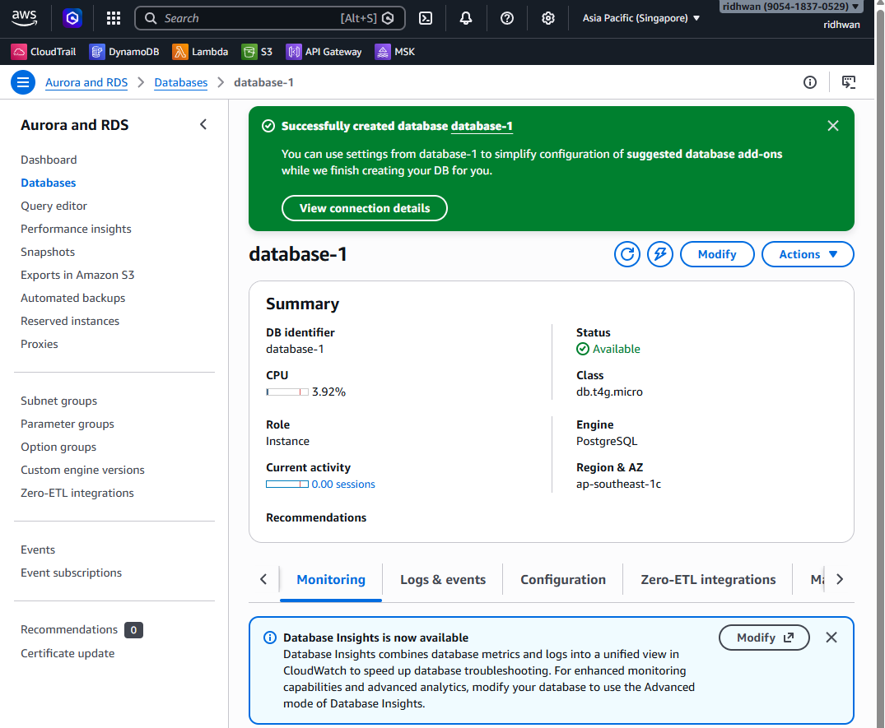
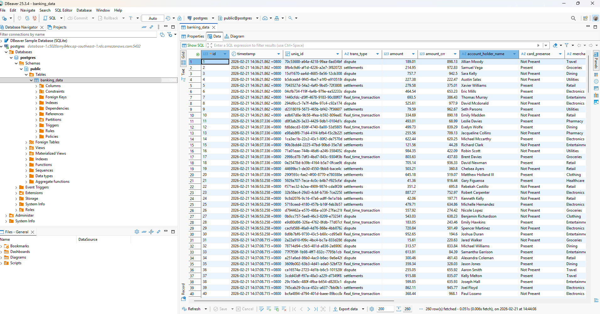
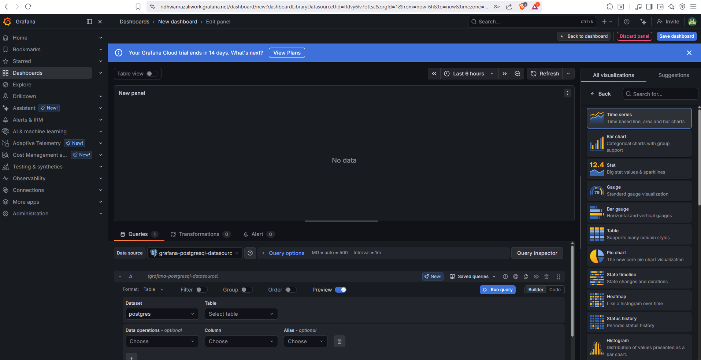
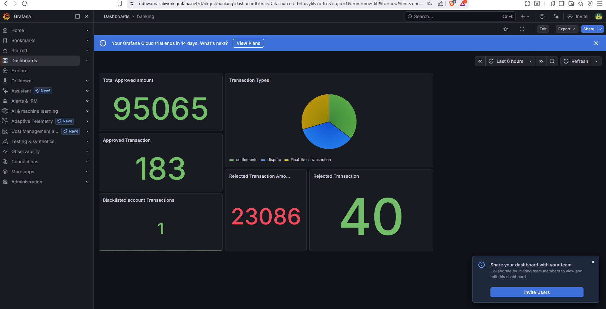

# Real-Time Banking Transaction Monitoring Dashboard

A test for generating synthetic banking transaction data, storing it in AWS RDS, and visualizing it with Grafana.

## 📋 Project Overview

This project demonstrates:
- **Data Generation**: Generates realistic fake banking transaction data using the Faker library
- **Data Storage**: Inserts data into AWS RDS PostgreSQL database in real-time
- **Data Visualization**: Creates interactive Grafana dashboards to monitor transactions
- **Fraud Detection Rules**: Applies rule-based logic to flag suspicious transactions

### Key Features
- 🔄 Real-time transaction data generation
- 🛡️ Rule-based fraud detection (blacklisted accounts, high-value transactions)
- 📊 Interactive Grafana dashboards
- ☁️ AWS RDS PostgreSQL integration
- 📈 Multiple visualization types (Stats, Pie charts, Bar charts)

---

## 🏗️ Architecture

```
Faker Library (Data Generation)
        ↓
Python Script (app.ipynb)
        ↓
Rules Engine (Fraud Detection)
        ↓
AWS RDS PostgreSQL
        ↓
Grafana Dashboard
```

---

## 🚀 Prerequisites

Before starting, ensure you have:
- AWS Account with RDS access
- Python 3.8+
- DBeaver (for testing DB connection)
- Grafana instance (local or cloud)
- Required Python packages (see `requirements.txt`)

---

## 📝 Setup Instructions

### Step 1: Create AWS RDS PostgreSQL Instance

1. Go to **AWS Console → RDS → Create Database**
2. Choose **PostgreSQL** as the engine
3. Configure:
   - DB Instance Identifier: `database-1`
   - Master Username: `postgres`
   - Master Password: Set a strong password
   - Public accessibility: **Enable** (for testing)
4. Create the database and note the **Endpoint** (hostname)

<div align="center">

</div>

### Step 2: Configure Security Group - Allow Inbound Traffic

**⚠️ IMPORTANT**: Your RDS instance MUST have an inbound rule to accept connections on port 5432.

1. In RDS Console, find your instance and select its **Security Group**
2. Click the security group link to open it
3. Go to **Inbound Rules** tab and check if a PostgreSQL rule exists
4. **If NO rule exists, ADD a rule**:
   - Type: **PostgreSQL** (or manually set TCP)
   - Port: **5432**
   - Source: **0.0.0.0/0** (allows all - for testing only)
5. Click **Save rules**

**WARNING (Testing only):** Do NOT enable public accessibility or leave Security Group source as `0.0.0.0/0` in production. Restrict access to `YOUR_IP/32`, a VPC-only subnet, or use a bastion/VPN for admin connections. Default VPC/public subnets and broad access are acceptable only for isolated experiments.

✅ **For Testing**: Using `0.0.0.0/0` allows anyone to connect (acceptable for testing)

⚠️ **Before Production**: Change source from `0.0.0.0/0` to your IP address (`YOUR_IP/32`) or your organization's IP range to restrict access

### Step 3: Test Connection with DBeaver

1. Open DBeaver and create **New Database Connection**
2. Select **PostgreSQL**
3. Configure:
   - **Server Host**: Your RDS endpoint (e.g., `database-1.c5020amy84ex.ap-southeast-1.rds.amazonaws.com`)
   - **Port**: `5432`
   - **Database**: `postgres`
   - **Username**: `postgres`
   - **Password**: Your master password
4. Click **Test Connection** → Should succeed

<div align="center">

</div>

<div align="center">

</div>

---

## 🔄 Running the Data Generator

### Update Connection Details

Edit `app.ipynb` with your actual RDS credentials:

```python
host = "your-rds-endpoint.ap-southeast-1.rds.amazonaws.com"
port = 5432
dbname = "postgres"
user = "postgres"
password = "your-master-password"
```

### Execute the Script

1. Install dependencies:
```bash
pip install -r requirements.txt
```

2. Run the Jupyter notebook or execute the Python script:
```bash
jupyter notebook app.ipynb
```

The script will:
- ✅ Create the `banking_data` table automatically
- ✅ Generate 10 fake transactions every 15 seconds
- ✅ Apply fraud detection rules
- ✅ Insert records into PostgreSQL

**Note**: The script runs indefinitely. To stop it, interrupt the kernel or modify the code to set a max iteration count.

---

## 📊 Creating the Grafana Dashboard

### Step 1: Add PostgreSQL Data Source

1. Open Grafana
2. Go to **Configuration → Data Sources → Add data source**
3. Select **PostgreSQL**
4. Configure:
   - **Host**: Your RDS endpoint
   - **Database**: `postgres`
   - **User**: `postgres`
   - **Password**: Your master password
5. Click **Save & test**

### Step 2: Create Dashboard Visualizations

Create a new dashboard and add the following queries and visualizations:

#### 1. **Rejected Transactions** (Stat)
```sql
SELECT COUNT(*) FROM banking_data WHERE decision = 'Rejected'
```

#### 2. **Approved Transactions** (Stat)
```sql
SELECT COUNT(*) FROM banking_data WHERE decision = 'Approved'
```

#### 3. **Total Approved Amount** (Stat)
```sql
SELECT SUM(amount) as total_approved FROM banking_data WHERE decision = 'Approved'
```

#### 4. **Total Rejected Amount** (Stat)
```sql
SELECT SUM(amount) as total_rejected FROM banking_data WHERE decision = 'Rejected'
```

#### 5. **Transaction Types** (Pie Chart)
```sql
SELECT trans_type, COUNT(*) as count FROM banking_data GROUP BY trans_type
```

#### 6. **Rules Triggered** (Bar Chart)
```sql
SELECT rules_triggered, COUNT(*) as count FROM banking_data WHERE trans_type = 'Real_time_transaction' GROUP BY rules_triggered
```

#### 7. **Blacklisted Account Transactions** (Bar Chart)
```sql
SELECT account_holder_name, COUNT(*) as transaction_count FROM banking_data WHERE account_blacklisted = true GROUP BY account_holder_name LIMIT 10
```

<div align="center">

</div>

<div align="center">

</div>

---


## 📁 Project Structure

```
grafana_test/
├── app.ipynb                 # Main data generator script
├── requirements.txt          # Python dependencies
├── sample_sql.txt           # Dashboard query templates
├── README.md                # This file
└── src/
    └── images/              # Screenshots
        ├── rds_creation.png
        ├── dbeaver_connection.png
        ├── dbeaver_connected_rds.png
        ├── grafana_create_visualization.png
        └── grafana_final_dashboard.png
```

---

## 🛠️ Troubleshooting

### Connection Error: "Connection refused"
- Verify RDS instance is running
- Check security group inbound rules allow port 5432
- Ensure public accessibility is enabled

### DBeaver Connection Failed
- Test with CLI: `psql -h YOUR_ENDPOINT -U postgres -d postgres`
- Verify credentials match RDS setup
- Check if SSL is causing issues (disable in DBeaver settings if needed)

### Dashboard Shows No Data
- Verify PostgreSQL data source connection is successful
- Check that the script is running and inserting data (`SELECT COUNT(*) FROM banking_data;`)
- Ensure queries match your table schema

---

## 🔐 Security Best Practices

⚠️ **Before Production**:
1. ✅ Restrict security group to your IP (`YOUR_IP/32`)
2. ✅ Use strong, unique passwords
3. ✅ Store credentials in environment variables, not hardcoded
4. ✅ Enable encryption in transit (SSL/TLS)
5. ✅ Regular backups of RDS instance

---

## 📚 Additional Resources

- [AWS RDS Documentation](https://docs.aws.amazon.com/rds/)
- [Grafana Documentation](https://grafana.com/docs/)
- [PostgreSQL Documentation](https://www.postgresql.org/docs/)
- [Faker Library](https://faker.readthedocs.io/)

---

---

## 🧹 Cleanup (Important: Avoid AWS Costs)

⚠️ **To prevent unexpected charges, clean up these AWS resources after testing:**

1. **Terminate RDS Database Instance**
   - AWS Console → RDS → Databases → Select instance → Delete
   - Uncheck "Create final snapshot" to avoid backup storage costs

2. **Delete EC2 Instance** (if used for Grafana)
   - AWS Console → EC2 → Instances → Select instance → Terminate instances

3. **Remove Security Groups**
   - AWS Console → EC2 → Security Groups → Delete any created for this project

4. **Release Elastic IPs** (if assigned)
   - AWS Console → EC2 → Elastic IPs → Release address


---

## 📝 License

This project is for educational and testing purposes.

## References
- MLOPS Udemy course from Krish Naik